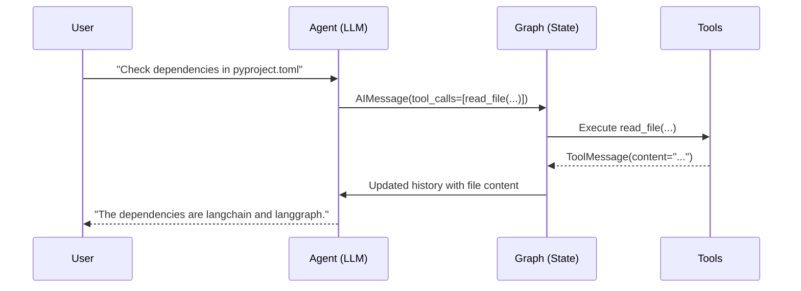

# Document Interaction Workflow

This document details the technical workflow of how the agent interacts with files on the local system. The process ensures that the agent can "see" and reason about file content in a structured and traceable manner, managed entirely within the LangGraph state.

## Core Concept: Everything is a Message

The fundamental principle is that every piece of information, including file content, is represented as a message in the conversation history. The agent doesn't have a separate "file viewer"; instead, file content is brought into its context just like a user's message or a tool's output.

## Step-by-Step Workflow

Here is the sequence of events when an agent needs to read a file:

### 1. The Decision to Read

The workflow begins when the Language Model (LLM), operating within the `chatbot` node, determines that it needs to read a file to fulfill a user's request.

-   **User Request:** "Can you check the dependencies in `pyproject.toml`?"
-   **LLM Reasoning:** The LLM processes this request and concludes that it must read the contents of the `pyproject.toml` file.

### 2. The `read_file` Tool Call

The LLM generates a response that is not a message for the user, but a structured request to call the `read_file` tool. This is represented as a `tool_calls` attribute on the AI message.

-   **AI Message Output:**
    ```json
    {
      "tool_calls": [
        {
          "name": "read_file",
          "args": {
            "absolute_path": "/path/to/project/pyproject.toml"
          }
        }
      ]
    }
    ```

### 3. Conditional Edge and Tool Execution

The `StateGraph`'s conditional edge (`tools_condition`) detects the `tool_calls` in the message and routes the control flow to the `tool_node`. The `tool_node` then executes the `read_file` function with the specified arguments.

### 4. The Tool Result Message

The `read_file` tool reads the file from the disk. The content is then packaged into a `ToolMessage`. This message contains the raw content of the file and is explicitly linked to the `tool_call` that initiated it via its `tool_call_id`.

-   **ToolMessage Output:**
    ```json
    {
      "type": "tool",
      "tool_call_id": "tool_call_123",
      "content": "[tool.poetry.dependencies]\npython = \"^3.9\"\nlangchain = \"^0.1.0\"\nlanggraph = \"^0.0.20\"",
      "name": "read_file"
    }
    ```

### 5. State Update

This `ToolMessage` is appended to the `messages` list in the `AgentState`. The conversation history now contains a complete record of the request to read the file and the file's content.

-   **Updated `AgentState.messages`:**
    1.  `HumanMessage(content="Check dependencies in pyproject.toml")`
    2.  `AIMessage(tool_calls=[...])`
    3.  `ToolMessage(content="[tool.poetry.dependencies]...")`

### 6. The Agent "Sees" the Content

The graph flows back to the `chatbot` node. The entire updated `messages` list is passed to the LLM as part of its prompt. The LLM now has the full context: the user's original request, its own decision to call a tool, and the resulting file content from that tool call.

The LLM can now reason based on this new information to formulate its final response to the user.

-   **LLM Reasoning:** "The user asked for dependencies. I read the file `pyproject.toml`. The content is `[tool.poetry.dependencies]...`. I can now extract the dependencies and list them."
-   **Final AI Message Output:**
    ```json
    {
      "content": "The dependencies listed in `pyproject.toml` are: langchain, langgraph."
    }
    ```

## Diagram of the Flow

