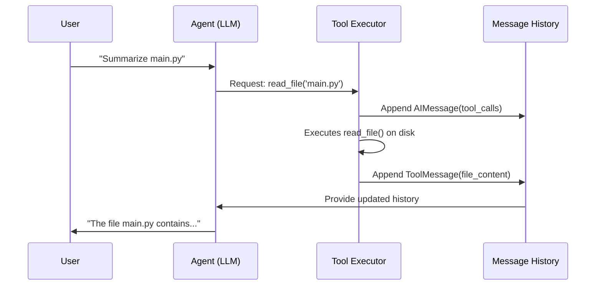

# Technical Brief: How Agents "See" Files

This document explains the general mechanism by which a modern AI agent interacts with a local file system. The key principle is that the agent does not "see" or "browse" files directly; its interaction is mediated through a structured, turn-based data flow.

## The Core Concept: The "Amnesiac with a Transcript" Model

A useful mental model for an agent's file awareness is that of an "amnesiac with a perfect transcript."

-   **The Agent is Stateless:** Between each turn, the agent has no memory of the previous turn's events.
-   **The Transcript is State:** The agent's entire "awareness" comes from a detailed transcript of the interaction that is provided to it in every single turn.

For an agent to "see" a file, the file's content must be written into this transcript by the external environment.

## The General Data Flow

The process of an agent reading and then reasoning about a file typically involves a two-turn cycle:

### Turn 1: The Request
1.  **User's Intent:** A user asks the agent to perform a task that requires knowledge of a file's content (e.g., "Summarize `main.py`").
2.  **Agent's Decision:** The agent, receiving only the user's request in its transcript, recognizes that it lacks the necessary information. Its only possible action is to use a tool to acquire that information.
3.  **Agent's Output:** The agent outputs a structured request to the environment, asking it to execute a `read_file` tool with the specific file path as an argument.

### The Inter-Turn: The Environment's Role
The agent's job is now done for this turn. The external environment or "harness" that runs the agent performs the following critical tasks:
1.  It receives the tool-use request from the agent.
2.  It executes the requested `read_file` function, which interacts with the actual disk and retrieves the file's content as a string.
3.  It appends both the agent's tool request and the resulting file content to the interaction transcript.

### Turn 2: The Synthesis
1.  **A New Prompt:** The environment assembles a new, expanded prompt for the agent. This prompt now contains the full history: the user's original request, the agent's decision to call a tool, and the raw text of the file returned by that tool.
2.  **Agent's Reasoning:** The agent now receives this expanded transcript. The file's content is now part of its input context. It can read and reason about this text to fulfill the user's original request.
3.  **Agent's Output:** The agent generates a final, user-facing response based on its analysis of the file content.

### Example Visualization

This sequence diagram illustrates the general flow:

## Key Architectural Principles

-   **Decoupling:** The agent's core reasoning logic is completely decoupled from the file system.
-   **Traceability:** This turn-based cycle is inherently traceable, which is invaluable for debugging.
-   **Security:** The environment can act as a security layer, sandboxing or restricting file access as needed.
