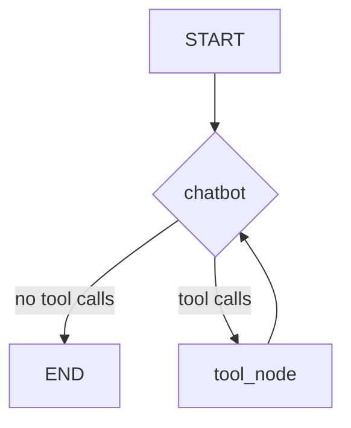

# Architecture

This document describes the high-level architecture of the agent, which is built around LangGraph. The architecture is designed to be a stateful, multi-actor system where the language model, tools, and user interact within a structured graph.

## Core Component: LangGraph State Machine

The agent's control flow is managed by a `StateGraph`. This graph defines the possible states the agent can be in and the transitions between them.

### State

The `State` of the graph is a `TypedDict` that holds all the information necessary for the agent to operate. Its primary component is a list of messages, which represents the conversation history.

```python
from typing import Annotated
from typing_extensions import TypedDict
from langgraph.graph.message import add_messages

class AgentState(TypedDict):
    messages: Annotated[list, add_messages]
    # Future additions could include:
    # user_info: dict
    # current_task: str
```

The `add_messages` annotation ensures that new messages are appended to the history rather than overwriting it.

### Nodes

Nodes are the fundamental units of work in the graph. They are Python functions or objects that operate on the current `AgentState`.

1.  **`chatbot` Node:**
    -   **Purpose:** This is the primary "brain" of the agent. It takes the current state (including conversation history and context) and invokes the language model.
    -   **Output:** The LLM's response, which could be a direct answer to the user or a request to use one or more tools.

2.  **`tool_node` Node:**
    -   **Purpose:** This node is responsible for executing tools. It inspects the last message from the `chatbot` node, and if it contains `tool_calls`, it executes the corresponding tools with the provided arguments.
    -   **Implementation:** We will use the prebuilt `ToolNode` from LangGraph for robustness and features like parallel tool execution.

### Edges

Edges define the flow of control between the nodes.

1.  **Entry Point:** The graph starts at the `chatbot` node.
    ```python
    graph_builder.add_edge(START, "chatbot")
    ```

2.  **Conditional Edge from `chatbot`:**
    -   **Purpose:** After the `chatbot` node runs, this edge determines the next step. It checks if the LLM's response contains a tool call.
    -   **Logic:**
        -   If `tool_calls` are present, the graph transitions to the `tool_node`.
        -   If no `tool_calls` are present, the LLM has provided a final answer, and the graph transitions to `END`.
    -   **Implementation:** We will use the prebuilt `tools_condition` from LangGraph.
    ```python
    graph_builder.add_conditional_edges("chatbot", tools_condition)
    ```

3.  **Edge from `tools` to `chatbot`:**
    -   **Purpose:** After the `tool_node` executes the requested tools, the results are appended to the state as `ToolMessage`s. The graph then transitions back to the `chatbot` node.
    -   **Logic:** This allows the LLM to process the tool results and decide the next step, which could be responding to the user or calling another tool.
    ```python
    graph_builder.add_edge("tools", "chatbot")
    ```

## Diagram



## Future Vision: Autonomous Actions

The current architecture can be extended to support autonomous actions. This would involve adding:
-   **A Scheduler:** A component that can trigger graph runs at specific times or intervals.
-   **New Nodes:** Nodes for tasks like "check inbox" or "send email."
-   **Persistent State:** A more robust checkpointer (e.g., using a database) to ensure the agent's state persists across runs and over long periods.
-   **Modified Graph Logic:** The graph would need new conditional edges to handle autonomous triggers and decide when to initiate contact with the user.
